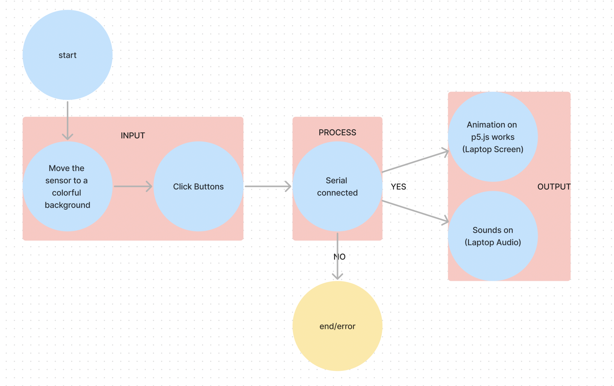
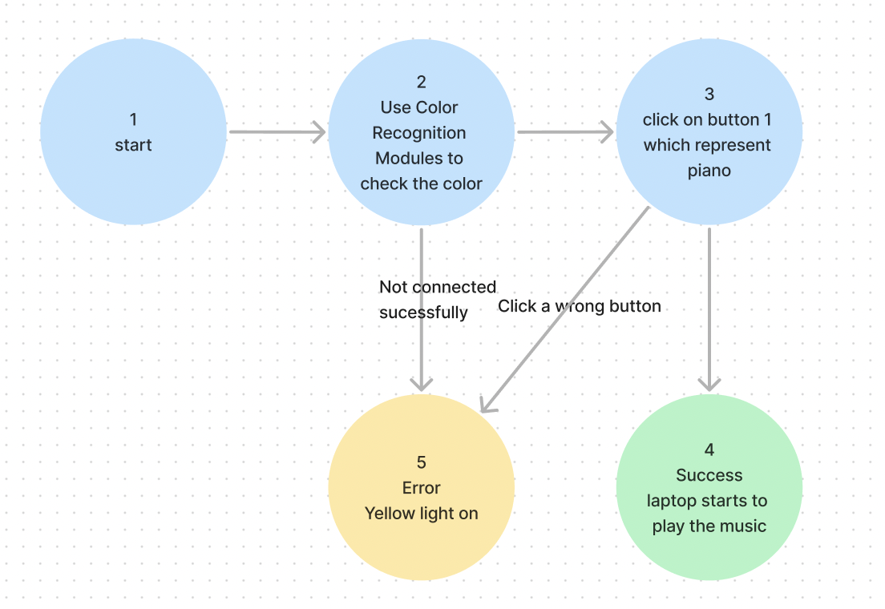
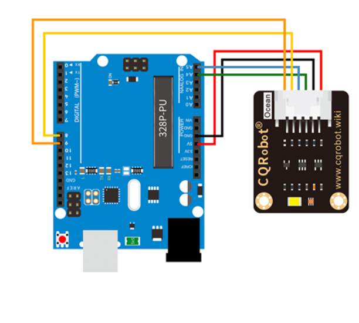
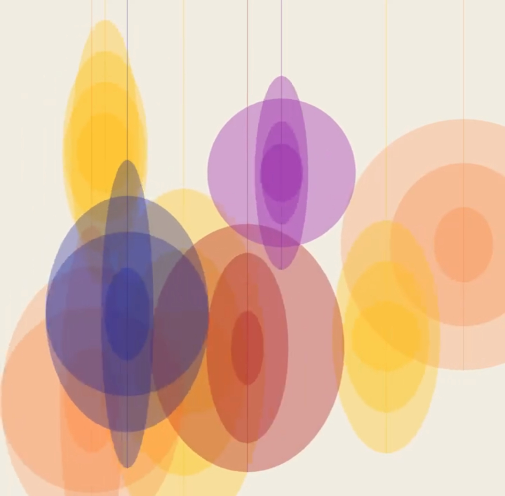

## Final Project Proposal
1. Arduino-P5.js Interactive Music Controller

The proposed project aims to create an interactive music controller that leverages color recognition through Arduino to control virtual piano keys and other musical instruments generated using p5.js. This project offers a creative and engaging way for users to interact with digital music through physical inputs. Arduino Board, Color Recognition Modules, Buttons(change different instruments), p5.js Integration(sound library) are necessary for this project. 

2. GPS-Mapped Action Trajectory Visualization

The proposed project aims to merge GPS mapping technology with the recording of movement trajectories using Arduino, and then visualize these trajectories on a map using p5.js. This project will create a visually compelling representation of actions, such as footprints or paths, overlaying them onto a digital map. GPS Module is needed for real-time location tracking.Interactive Elements: Allow users to interact with the visualized trajectory, such as zooming in/out or selecting specific timeframes.

3. Electronic Heartbeat Visualization

The proposed project aims to leverage the Arduino pulse beat sensor to detect and identify the user's heartbeat in real-time. This heartbeat data will then be used to control and visualize the beating degree and frequency of an electronic heart displayed through p5.js. The project focuses on creating an interactive and visually engaging electronic health visualization tool. Pulse Beat Sensor is needed to detect real-time heartbeat data. 

## WEEK 12 UPDATE
I decided to chose the first proposal "Interactive Music Controller" for my final project.

**Interactions:**
- **Color Recognition:** Users interact by presenting colored objects to the color recognition modules.
- **Buttons:** Users can press buttons to switch between different musical instruments.
- **Arduino Input:** Arduino collects data from color recognition modules and buttons.
- **p5.js Output:** The collected data is used to control virtual piano keys and other instruments generated using p5.js.

**Data Flow:**
1. **Color Recognition Data:**
   - Produced: Color recognition modules capture color data.
   - Collection: Arduino reads color data through sensors.
   - Transfer: Arduino sends color data to the computer/browser via serial communication.
2. **Button Data:**
   - Produced: Button presses generate data.
   - Collection: Arduino detects button presses.
   - Transfer: Arduino sends button data to the computer/browser via serial communication.
3. **p5.js Output:**
   - Produced: Sound and virtual instrument data generated by p5.js.
   - Transfer: p5.js receives color and button data from Arduino via serial communication.
   - Interaction: p5.js adjusts virtual instrument output based on received data.

**Materials:**
- **Electronic Materials:** Arduino board, color recognition modules, buttons.
- **Sensors:** Color recognition modules.

**User:**
- **Audience:** Anyone interested in interactive music experiences, for example: children, students, musicians...

**Testing:**
- **User Testing:** Gather feedback from users on the usability and engagement of the interactive music controller.
- **Functional Testing:** Ensure color recognition, button inputs, and p5.js interactions work seamlessly.
- **Iterative Testing:** Test and refine the project based on user feedback and technical performance.

**Development:**
- **Challenges:** Integrating color recognition, button input, and p5.js interactions seamlessly might be challenging.
- **Stretch Features:**
  - Multi-color recognition for diverse inputs.
  - Customizable instrument mappings.
- **Backup Plan:** Physical sensor could be more decoratative.

**System diagram**
Here is the system diagram including simple description of input, process and output.

**FSM diagram**
Here is the first draft of FSM, I may add more buttons(instruments) later.

**Circuit diagram**
Here is the circuit diagram for color sensor function.

**external data or library**
Arduino Serial Communication Library
P5.js Library
p5.sound Library

**sensor, output component or mechanism**
Color Recognition Modules: Input component.
Buttons: Input component.
RGB LEDs: Output component.

**Reference images, texts and projects**
Here is the visual reference to show the color.

**how is it related to our readings?**
Using music, sound and visual elements to create a balance between human experiences and media could be a new way to make music education more interesting, and not only limited to one sense(sound), but also could be visualized. 

**how does it connected to society?**
Engagement: Provides an engaging way for individuals to interact with digital music.
Accessibility: Offers a creative musical outlet, potentially accessible to diverse audiences.
Technological Interaction: Represents the integration of physical inputs with digital music, reflecting the evolving relationship between technology and creativity.

## Week 13 Update
My circuit is the same as the one I used last week.
In this week, I added more p5js visual elements and audio library.

For the next week, I will complete the whole visual effect, and make sure the audio plays correctly to the corresponding color.

## FINAL
**System diagram**

**FSM diagram**

**Circuit diagram**

**External data and library**
Arduino Serial Communication Library
P5.js Library
p5.sound Library

**Sensor, output component and mechanism**
Color Recognition Modules: Input component.
Buttons: Input component.
Screen: Output component.

**Reference images, texts and projects**
Here is the visual reference.

**how is it related to our readings?**
By immersing individuals in the simulated sounds and scenes of a forest, this project aims to prompt reflection on the intricate relationship between humans and nature in our contemporary, digital age. The choice of a forest setting is symbolic, representing the richness of nature. Forests are often viewed as ecosystems that thrive in balance, offering an analogy for the desired equilibrium between humans and the digital realm.

**how does it connected to society?**
This project prompts contemplation not only on individual experiences but also on the broader societal impact of our digital interactions on the natural world. Placing this reflection within the context of the digital age adds a layer of relevance. It acknowledges the transformative impact of technology on our lives while questioning its potential consequences on our connection to nature.

**why is it important to you?**
Integrating music, sound, and visuals creates a multisensory experience which is important to me. This approach not only appeals to our auditory and visual senses but also provides a holistic encounter that engages individuals on a deeper level. This represents a progress of my UX design experiences.

**feedback from user testing**
Clearer instructions may be needed to tell users the order in which buttons and sensors should be used.
The background can be pictures of forest that changes from day to night instead of simple color changing.