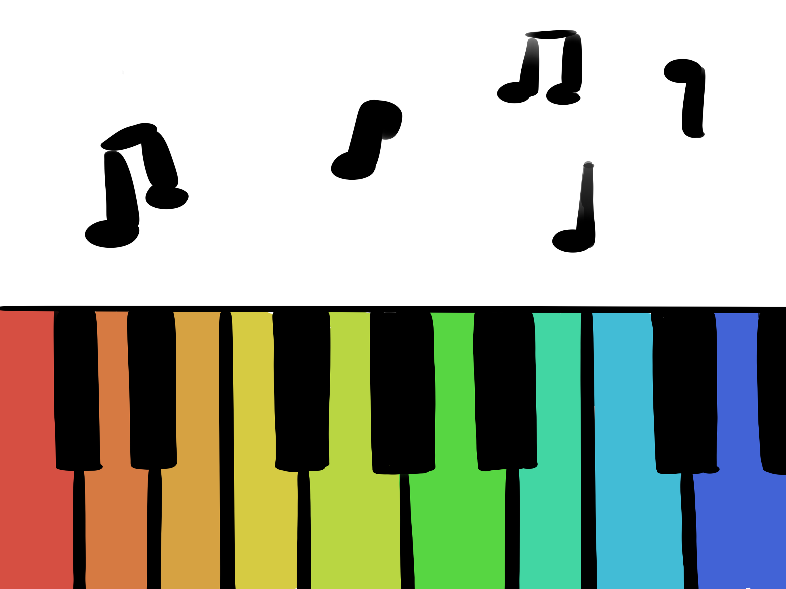
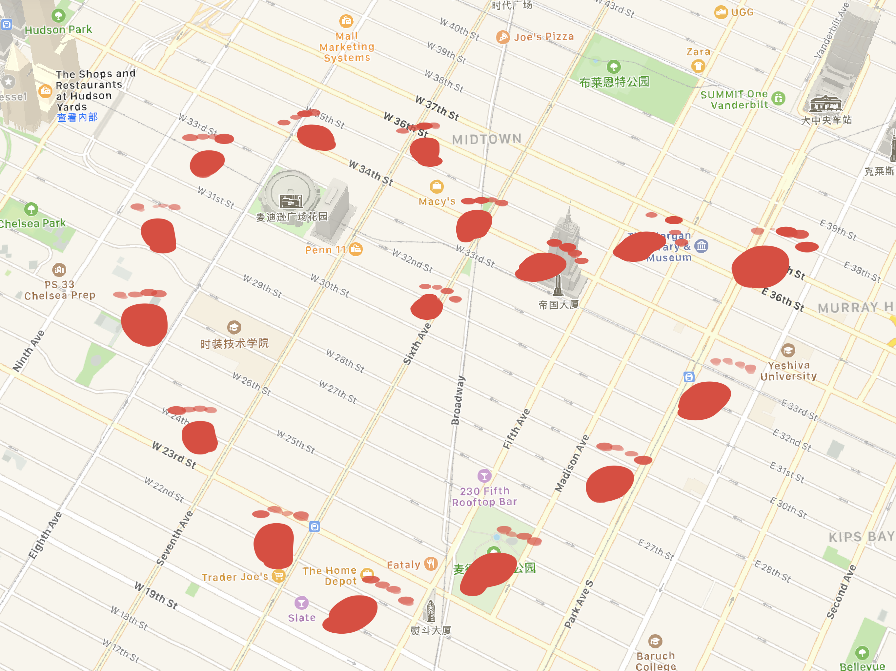
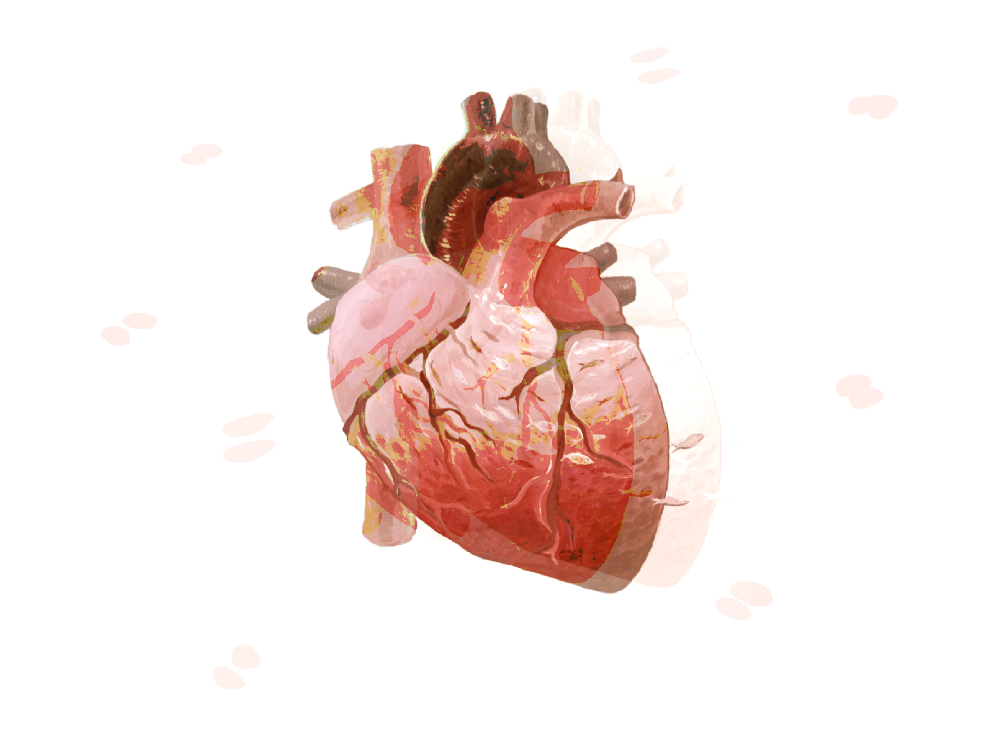

## Final Project Proposal
1. Arduino-P5.js Interactive Music Controller

The proposed project aims to create an interactive music controller that leverages color recognition through Arduino to control virtual piano keys and other musical instruments generated using p5.js. This project offers a creative and engaging way for users to interact with digital music through physical inputs. Arduino Board, Color Recognition Modules, Buttons(change different instruments), p5.js Integration(sound library) are necessary for this project. 

2. GPS-Mapped Action Trajectory Visualization

The proposed project aims to merge GPS mapping technology with the recording of movement trajectories using Arduino, and then visualize these trajectories on a map using p5.js. This project will create a visually compelling representation of actions, such as footprints or paths, overlaying them onto a digital map. GPS Module is needed for real-time location tracking.Interactive Elements: Allow users to interact with the visualized trajectory, such as zooming in/out or selecting specific timeframes.

3. Electronic Heartbeat Visualization

The proposed project aims to leverage the Arduino pulse beat sensor to detect and identify the user's heartbeat in real-time. This heartbeat data will then be used to control and visualize the beating degree and frequency of an electronic heart displayed through p5.js. The project focuses on creating an interactive and visually engaging electronic health visualization tool. Pulse Beat Sensor is needed to detect real-time heartbeat data. 
 